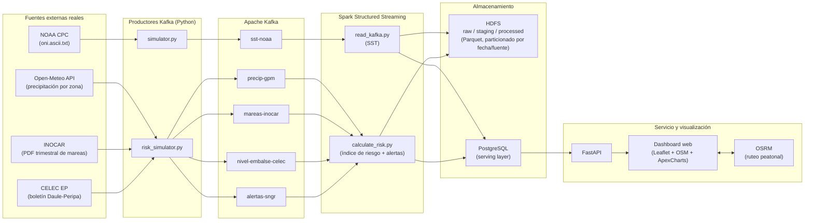

# Informe Técnico

## Plataforma de Big Data para Monitoreo de El Niño y Riesgo de Inundación en Guayaquil (2026)

---

## 1. Presentación y objetivo

Ecuador atraviesa un episodio del fenómeno de El Niño con proyecciones de intensificación durante 2026. Este proyecto implementa una plataforma de procesamiento masivo de datos que ingiere, procesa y visualiza en tiempo (cuasi) real información satelital, hidrometeorológica y de marea relacionada con El Niño, y la traduce en un mapa de riesgo de inundación para Guayaquil con rutas de evacuación sugeridas.

El pipeline cubre el ciclo completo exigido por la consigna: **ingesta (Kafka) → procesamiento distribuido (Spark Structured Streaming) → almacenamiento (HDFS + PostgreSQL) → visualización (API + dashboard web con mapa Leaflet/OpenStreetMap)**.

---

## 2. Arquitectura general



**Infraestructura Docker** (`docker/docker-compose.yml`): `namenode` + `datanode` (HDFS), `gye_kafka` (Kafka 3.7 en modo KRaft, sin Zookeeper), `gye_spark_master` + `gye_spark_worker` (Spark 3.5.1), `gye_postgres` (PostgreSQL 16, serving layer) y `gye_grafana` (panel operativo adicional). Los productores Python y el backend FastAPI corren en el host, fuera de Docker, contra los puertos expuestos.

---

## 3. Fuentes de datos

| Categoría (consigna) | Fuente usada | Endpoint / mecanismo | Frecuencia real de la fuente | Frecuencia de refresco en el pipeline |
|---|---|---|---|---|
| Monitoreo ENSO nacional/regional | **NOAA CPC** — índice ONI (región Niño 3.4) | `GET https://www.cpc.ncep.noaa.gov/data/indices/oni.ascii.txt` (texto ASCII, parseado con `pandas`) | Mensual | 24 h (con caché en memoria) |
| Precipitación satelital | **Open-Meteo** (proxy abierto de modelos meteorológicos, sustituye a NASA GPM/Copernicus para la demo) | `GET https://api.open-meteo.com/v1/forecast?current=precipitation` — una llamada **por zona**, con el lat/lon propio de cada sector | Sub-horaria | 15 min por zona (caché independiente por coordenada) |
| Infraestructura hídrica — embalse | **CELEC EP**, sistema Daule-Peripa | Sin API pública minuto a minuto → se usa la última cota operativa reportada en boletín técnico (83.07 m) | No hay API en vivo | Valor fijo, documentado como limitación (sección 8) |
| Marea / estuario | **INOCAR** — tabla trimestral de predicción de mareas, puerto de Guayaquil (Río Guayas) | `GET https://www.inocar.mil.ec/mareas/TM/{año}/trimestral/GUAYAQUIL_RIO_{trimestre}.pdf` — descarga de PDF y extracción con `pdfplumber` | Trimestral (predicción astronómica) | 1 h; se selecciona la predicción más cercana a la hora actual (ver sección 7.1) |
| Alertas/afectaciones (SNGR) | **Modelo propio inspirado en la metodología SNGR** (no es un scraping del sitio de SNGR) | Calculado en `risk_simulator.py` a partir de lluvia y marea reales medidas | — | Cada ciclo (5 s) |
| Geoespacial — red vial, edificaciones, cuerpos de agua | **OpenStreetMap** | Tiles OSM + red vial consumida por el motor de ruteo OSRM | — | Bajo demanda (cálculo de ruta) |
| Topografía / cotas | Cotas de referencia por sector (Isla Trinitaria 2 m, Suburbio Oeste 3 m, Daule 4.5 m, Sauces 5 m, Samborondón 3.5 m, Samanes 9 m), consistentes con SRTM/Copernicus DEM para la zona | Valores fijos por zona, documentados en `risk_simulator.py` | — | Estático |
| Validación — zonas históricamente inundables | Recopilación manual de reportes de prensa/municipales (Sauces 6, Sauces 3, Av. Barcelona, Trinitaria Sur, Suburbio Oeste, Daule 1997/1998) | Capa de referencia en el mapa | — | Estático |

> **Nota de honestidad metodológica:** de las categorías exigidas por la consigna, **SST, precipitación y marea son ingeridas desde fuentes reales en vivo**. El nivel del embalse y las alertas SNGR **no** provienen de una API oficial (no existe una pública) — se documentan explícitamente como valores/reglas derivadas, no como feeds oficiales, para no sobrerrepresentar el alcance del proyecto.

---

## 4. Ingesta (Kafka)

Cada fuente publica en su propio topic, en JSON con marca de tiempo ISO-8601:

| Topic | Productor | Payload |
|---|---|---|
| `sst-noaa` | `simulator.py` | `{timestamp, source, variable, value, unit, location}` — SST absoluta (°C) |
| `precip-gpm` | `risk_simulator.py` | Precipitación real (mm/h) por zona |
| `mareas-inocar` | `risk_simulator.py` | Altura de marea real (m) |
| `nivel-embalse-celec` | `risk_simulator.py` | Cota del embalse Daule-Peripa (boletín) |
| `alertas-sngr` | `risk_simulator.py` | Alerta calculada (Verde/Amarilla/Naranja/Roja) por zona |

El envío usa `kafka-python` (`KafkaProducer`) con `value_serializer` JSON y confirmación síncrona (`future.get(timeout=15)`), de forma que un fallo de envío se registra sin detener el productor.

---

## 5. Procesamiento (Spark Structured Streaming)

Dos jobs corren simultáneamente en `gye_spark_master` (`spark-submit --master spark://spark-master:7077`):

- **`read_kafka.py`**: consume `sst-noaa`, clasifica el estado térmico (`Fría` <26°C, `Normal` 26–29°C, `Posible El Niño` ≥29°C) y escribe a HDFS (Parquet) y PostgreSQL (`sst_procesada`) cada 5 segundos.
- **`calculate_risk.py`**: consume `precip-gpm`, `mareas-inocar`, `nivel-embalse-celec` y `alertas-sngr`.
  - Usa **windowing** (`window("event_time", "30 seconds", "5 seconds")`) con watermark de 30 s para agregar las últimas lecturas por zona.
  - Calcula el **índice de riesgo compuesto** (sección 7).
  - Escribe la zona *raw* (evento crudo tal cual llega de Kafka) y *staging* (datos normalizados, particionados por `event_date` y `source`) a HDFS, y el resultado *processed* a HDFS + PostgreSQL (`riesgo_zonas`, `alertas_sngr`) para servir al API.

---

## 6. Almacenamiento (HDFS)

```
hdfs://namenode:9000/el_nino/
├── raw/
│   ├── hidrometeorologia/       ← evento Kafka crudo (topic, partition, offset, payload)
│   └── alertas_sngr/
├── staging/
│   ├── hidrometeorologia/       ← particionado por event_date/source, esquema normalizado
│   └── alertas_sngr/            ← particionado por event_date/alert_level
└── processed/
    └── riesgo_zonas/            ← índice de riesgo final por zona y ventana de tiempo
```

Todo en formato **Parquet**, particionado por fecha y fuente, tal como exige la consigna. PostgreSQL actúa como *serving layer* de solo el estado vigente (para que el dashboard consulte con baja latencia sin golpear HDFS directamente).

---

## 7. Modelo de riesgo de inundación

### 7.1 Marea: de predicción trimestral a "ahora"

El PDF de INOCAR es una tabla de predicción astronómica para todo el trimestre (3 meses × 2 mitades de mes = 6 columnas por página). El texto plano de la librería de extracción intercala esas columnas línea por línea, por lo que el orden de aparición del texto **no** corresponde al orden cronológico. Se reconstruye la fecha real de cada lectura usando la posición (x, y) de cada palabra en el PDF para separar las 6 columnas, y luego se selecciona la predicción de marea (pleamar/bajamar) **más cercana en el tiempo al instante actual**, en lugar de interpolar una curva continua — simplificación razonable dado que INOCAR solo publica extremos puntuales, no series continuas.

### 7.2 Índice compuesto (0–100) por zona

| Componente | Peso máx. | Regla |
|---|---:|---|
| Precipitación | 35 | ≥45 mm/h → 35 · ≥25 mm/h → 22 · si no → 8 |
| Marea | 25 | ≥3.2 m → 25 · ≥2.5 m → 15 · si no → 5 |
| Embalse Daule-Peripa | 15 | ≥90% → 15 · ≥80% → 8 · si no → 3 |
| Vulnerabilidad local (topografía/histórico) | 20 | `vulnerabilidad_base × 20`, fija por zona (0.35–0.95) |
| **Efecto combinado lluvia + marea alta** | +10 | Se suma solo si lluvia ≥25 mm/h **y** marea ≥2.5 m simultáneamente |

Clasificación resultante: **Bajo** (<30) · **Medio** (30–49) · **Alto** (50–69) · **Crítico** (≥70).

El **bono de +10 por efecto combinado** es la pieza central que exige la consigna: modela por qué la coincidencia de lluvia intensa y marea alta agrava el riesgo — la marea alta reduce o anula la descarga por gravedad del sistema pluvial hacia el estuario, represando el agua dentro de la ciudad. No es un modelo hidráulico (no se simula caudal, pendiente ni capacidad real de alcantarillado), sino un índice ponderado simplificado pero justificado con datos reales de entrada.

### 7.3 Alertas SNGR (sistema independiente)

Las alertas del panel lateral usan umbrales propios sobre lluvia y marea crudas (no el índice compuesto): Roja (lluvia ≥45 mm/h y marea ≥3.2 m), Naranja (lluvia ≥30 o marea ≥2.8 m), Amarilla (lluvia ≥15 o marea ≥2.2 m), Verde en el resto. Al ser un sistema de reglas distinto al índice de riesgo del mapa, una misma zona puede mostrar niveles aparentemente distintos en cada panel — es esperado, no un error de sincronización.

---

## 8. Mapa interactivo y capas

Implementado con **Leaflet** sobre tiles de OpenStreetMap. Capas seleccionables e independientes:

1. **Topografía / cotas DEM** — cotas de referencia por sector.
2. **Red hidrográfica y esteros** — ríos Daule/Babahoyo y esteros urbanos.
3. **Intensidad de precipitación** — acumulado reciente real por zona (Open-Meteo).
4. **Nivel de marea (INOCAR)** — pleamar/bajamar vigente.
5. **Escenario combinado** (lluvia intensa + marea alta) — resalta el índice de riesgo con el bono de la sección 7.2 activo.
6. **Zonas históricamente inundables** — capa de referencia/validación con reportes documentados (Sauces, Suburbio Oeste, Trinitaria, Daule).

Al hacer clic en una zona se muestra el nivel de riesgo, sus variables de entrada y el desglose del cálculo del índice.

---

## 9. Rutas de evacuación

Motor de ruteo: **OSRM público** (`router.project-osrm.org`), perfil peatonal, sobre la red vial de OpenStreetMap. El usuario selecciona una zona de origen; el frontend calcula la ruta al albergue seguro más cercano de un catálogo de 3 albergues en cotas altas (Samanes, Suburbio/Ciudadela Universitaria, Trinitaria zona alta) y dibuja la geometría real de la ruta (`overview=full&geometries=geojson`) junto con distancia y tiempo estimado.

---

## 10. Limitaciones conocidas

- **Embalse Daule-Peripa**: CELEC EP no publica una API pública en tiempo real; se usa un valor fijo del último boletín técnico. El campo está etiquetado explícitamente como "Boletín", no como medición en vivo.
- **Alertas SNGR**: son un modelo de reglas propio inspirado en los niveles de alerta de SNGR, no un feed oficial scrapeado de `gestionderiesgos.gob.ec`.
- **Precipitación por zona**: se usa Open-Meteo (modelo meteorológico interpolado) como proxy abierto de NASA GPM/Copernicus, consultando el punto exacto de cada zona; no es una imagen satelital de precipitación real píxel a píxel.
- **Marea**: INOCAR publica predicciones astronómicas puntuales (pleamar/bajamar), no una serie continua; se usa la predicción más cercana a "ahora" como aproximación, sin interpolar la curva sinusoidal entre dos extremos.
- **Modelo de riesgo**: es un índice ponderado simplificado, no un modelo hidráulico validado (no considera capacidad real de alcantarillado, infiltración del suelo ni topografía de alta resolución más allá de la cota de referencia por zona).
- **Rutas de evacuación**: dependen del servicio público de OSRM (sin SLA garantizado); en producción se recomendaría una instancia propia de OSRM/GraphHopper.

---

## 11. Trabajo futuro

- Sustituir el valor fijo del embalse por un scraper de los boletines PDF/HTML de CELEC EP, replicando el patrón ya usado para INOCAR.
- Integrar directamente NASA GPM o Copernicus Sentinel para precipitación satelital de mayor resolución espacial.
- Reemplazar el motor OSRM público por una instancia propia, y sumar restricción de rutas por zonas ya inundadas en el escenario activo.
- Incorporar un DEM real (SRTM 30 m / Copernicus DEM) para derivar pendientes y cuencas de drenaje en vez de cotas de referencia fijas por zona.
